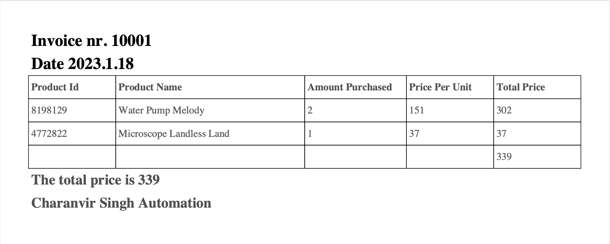

# Invoice Generator

## Convert an Excel spreadsheet to an invoice PDF file

 

## <u>Table of Contents</u>

1. [Description](#Description)
2. [Installation](#Installation)
3. [Usage](#Usage)
4. [Contributing](#Contributing)
5. [Authors](#Authors)
6. [License](#License)

## Description

Invoice Generator is a CLI tool which takes ordering data from an Excel spreadsheet and converts it into an invoice pdf
file. It can convert multiple Excel spreadsheet at once, thus automating the process. The generated invoice includes the
products sold, along with the amount purchased and the price per unit. The script also finds the total price for the
invoice, and it is displayed below the relevant purchasing data.

### Dependencies

This application uses both standard and third party Python modules to achieve its functionality.

#### Standard Modules

##### glob

The glob module is used to group all the Excel spreadsheets into one List, making it easier to generate PDF files for
multiple Excel files.

##### pathlib

The pathlib module is used to extract the relevant strings for each Excel file name and file path. This string is used
to name the invoice PDF file.

#### Third Party Module

##### fpdf

The fpdf module is installed and used to create and format the pdf file.

##### pandas

The pandas module is installed and used to read the data from the Excel spreadsheets.

## Installation

To install this application to your local machine, either download the source code, or run the following command in your
terminal:

```commandline
git clone https://github.com/Charanvir/Invoice-PDF.git
```

This will clone the source code repository.

## Usage

To use this application, you must have Python3 installed on your local machine. You must also install the third party
modules that are highlighted in the dependencies section of this document above.

To run the application:

```commandline
python3 main.py
```

This will generate the pdf files in the PDFs folder located in the root directory of this project.

To customize the pdf outputs, replace the invoice Excel files with your own, but note that the overall format should
remain the same. The heading columns should remain the same as the sample ones included in this repository. The name of
the invoice files will also be the names of the outputted pdf files, so those can be changed to your liking as well. We
recommend you keep the format your invoice files as following:

```commandline
file name-yyyy-mm-dd.xlsx
```

This will ensure that the date is also displayed in the outputted pdf file.

### Sample Excel Stylesheet


### Sample Invoice PDF Output



## Contributing

We are always looking to improve your application and code, so if you wish to contribute, please create a repository and
push all changes you make to it. Then email me at charanvir123@gmail.com, and I will try to get back to you after I have
reviewed the code.

## Authors

To view more projects visit my [GitHub](https://github.com/Charanvir) account.

Direct any additional questions you have regarding this application to charanvir123@gmail.com

# License

The following application is covered under the MIT License.